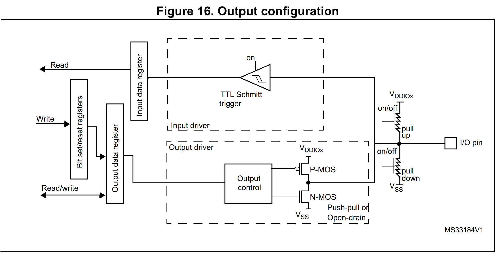
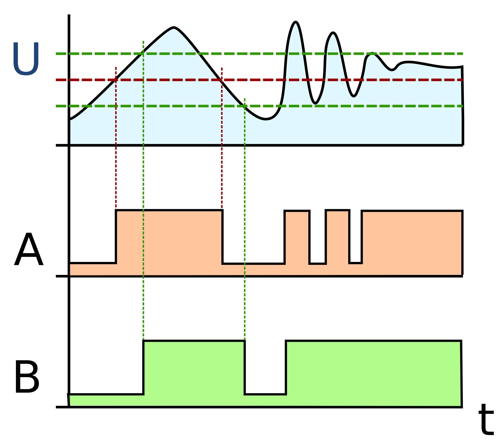
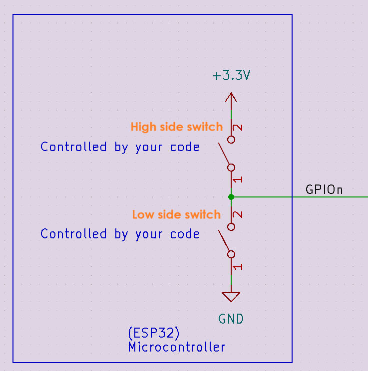
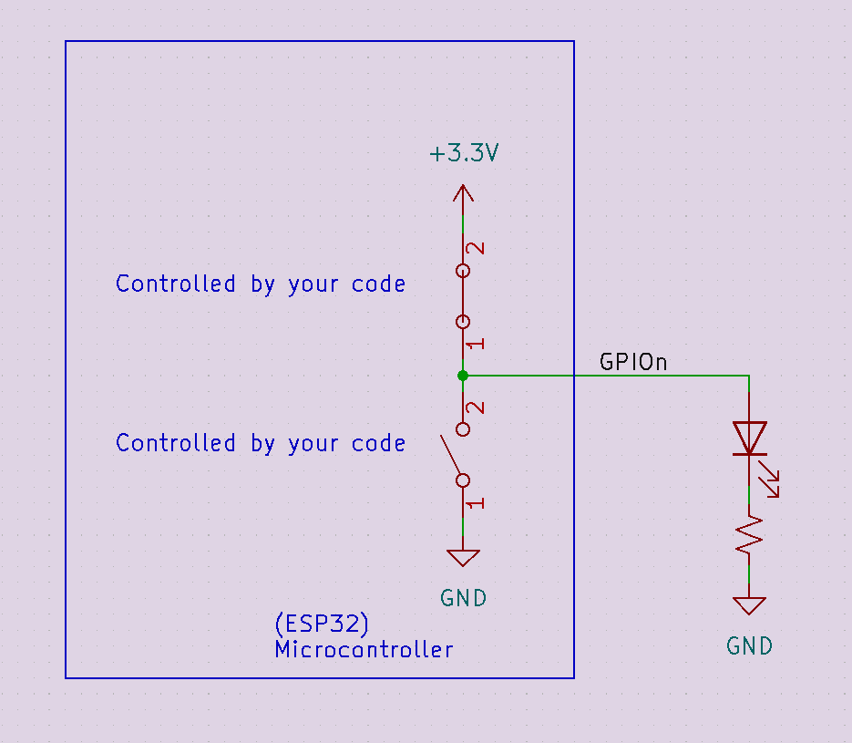
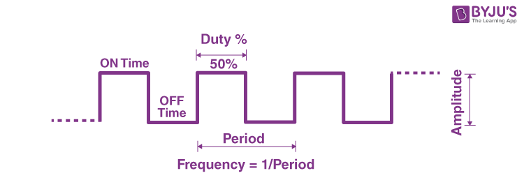
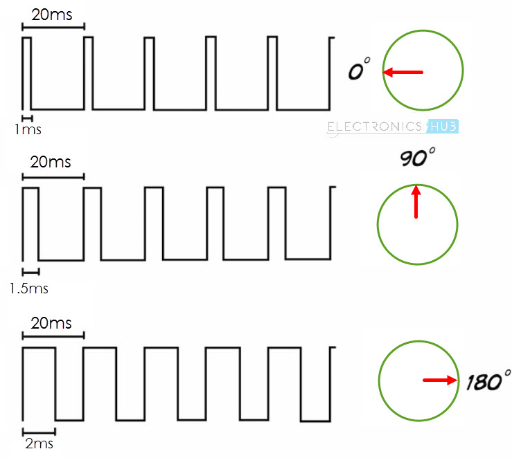
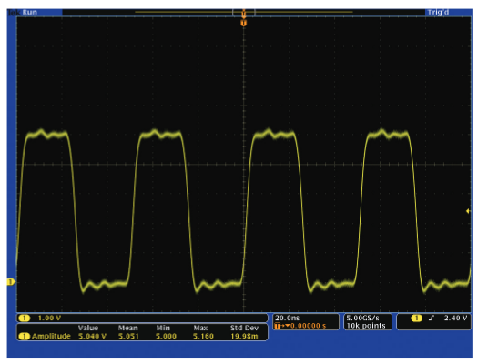
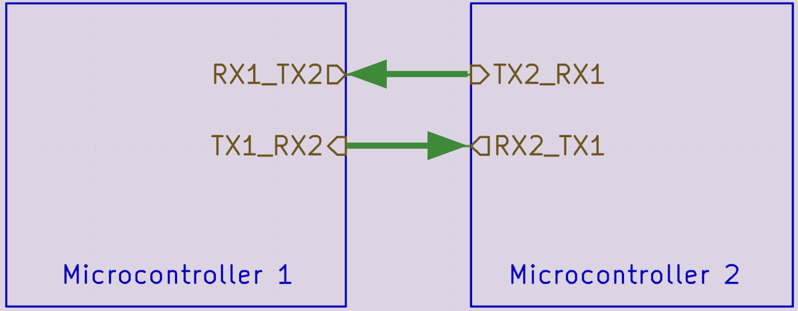

---
# Page settings
layout: default
keywords:
comments: false

# Hero section
title: Lecture 5 - Digital Communication
description: A lot of our systems involve microcontrollers and digital communications! Let's learn about how digital communication works so we can test our devices to ensure it works!

author:
    title: Lecture 5 Slides
    title_url: 'https://docs.google.com/presentation/d/1MFhq3Xi1Iv8xNcAMB3qwH_-JCsS6goqU_sXRIc1KfAY/edit?usp=sharing'
    external_url: true
    description: Slides provide more of a summary, the lecture notes here are more thorough

# Micro navigation
micro_nav: true

# Page navigation
page_nav:
    prev:
        content: Lecture 04
        url: '../../lecture_04'
    next:
        content: Lecture 06
        url: '../lecture_06'
---

# Lecture recording

<iframe width="560" height="316" src="https://www.youtube.com/embed/sekIc2njkhc" title="The Art and Science of PCB Design (IAP 2024) - Lecture 05" frameborder="0" allow="accelerometer; autoplay; clipboard-write; encrypted-media; gyroscope; picture-in-picture; web-share" allowfullscreen></iframe>

# 00 - Why this lecture?

We honestly didn't expect to be giving this lecture at first. But then, when we looked at what students are designing, we thought that digital communication should be something we cover. It's mostly aimed to help all of you understand better how these devices communicate so you could understand your circuits better. We're hoping that this helps you lay out and debug these systems later on in your life, and we've added some tips on best practices when it comes to these communication protocols to help you out.

# Controlling outputs with a Microcontroller

## So what's inside a microcontroller?

Inside microcontrollers are these amazing devices called *mosfets*. You may have heard of them, and they are remarkably small yet efficient switches that allow the microcontroller to control general-purpose outputs. Let's look at how they drive an output pin. Here's a typical GPIO (general purpose Input/Output pin) on a microcontroller.



Image credit: [ST](https://www.st.com/resource/en/reference_manual/rm0360-stm32f030x4x6x8xc-and-stm32f070x6xb-advanced-armbased-32bit-mcus-stmicroelectronics.pdf)

There's a lot to take in, so let's break it down. The rectangular blocks with squares ae logic blocks, so let's ignore those for now. There's 2 MOSFETs on the output driver-- a P-MOS and an N-MOS. These act as the switches that control what the I/O pin should be connected to.

There's also pull-up and pull-down resistors that can be digitally controlled. They are resistors if you tell it to be on, and an open circuit if you tell it to not be connected.

Finally, there's the input driver. The TTL Schmitt trigger sounds very fancy, but it's actually quite basic. It reads the I/O pin and sends a high/low signal depending on if the I/O pin is high/low. What's special is it requires a significant voltage input change of 0.4 - 1V (known as hysteresis) in order to change its signal output to the input data register. Here's an example graph. With B, you can see how the output doesn't change if the input U doesn't change beyond the green lines (representing the hysteresis voltage). With a conventional comparator, the output is simply compared to a red reference voltage. Small voltage changes cause the output A to go up and down due to noise.



Image credit: [Wikipedia](https://en.wikipedia.org/wiki/Schmitt_trigger#/media/File:Smitt_hysteresis_graph.svg)

Okay. Let's simplify this a bit now. We're only going to look at the output section for now. We're also going to replace the MOSFETs with switches for simplicity. We're going to refer to the top switch as the high side switch, and the bottom switch as the low side switch.



Let's say we want to turn on an LED that's connected to GND on one end through a resistor. Which switch should we connect? The high-side switch!



Great! But what if we wanted a dimming option?

## PWM and dimming

Let's walk to the nearest light switch. Grab a camera (or your phone), and stick it on long-exposure mode. Now, turn your lights on and off really fast. If you were to took a long-exposure picture, the photo would turn out dimmer than if you left the lights on and took the photo! This is because the length of time the photo is sampling is much longer than the light switching speed. This means the camera can't see the on/off pattern and instead averages it out.

Well, our eyes happen to not recognize flickering over 60 Hz. *Yes, this includes all the gamers out there*. If we could have our microcontroller turn the LED on and off faster than 60 times a second, we wouldn't perceive the LED blinking! If you have a working LED PCB, you can try this yourself! See [Appendix](#Appendix)

We've just describes what's called pulse width modulation! What this means is that we can change the on-time (referred to the duty cycle or pulse width) in order to control the brightness (or more generally: the average voltage). The frequency describes how fast the device is switching.



Image credit: [BYJU](https://byjus.com/physics/pulse-width-modulation/)

## Sending information

Let's say that we want to send data between 2 devices. We could use the pulse width to indicate some data. This is common on many servos! In the servo datasheets, they specify that a 1ms pulse width represents $0^\circ $, and a 2ms pulse width represents $180^\circ $. If we wanted $1^\circ$ of precision, then we would need to measure the pulse width with a precision of $\frac{1ms}{180}$ = 5us. For reference, the Arduino Nano has a delayus() function that tends to be off by roughly 1us.


Image source: [Electronics hub](https://www.electronicshub.org/raspberry-pi-servo-motor-interface-tutorial/)

The signal also doesn't have an infinite rise time. Here's an example of a digital signal, and the signal takes time to go from low to high! It's ambiguous to decide which point the signal officially becomes "high", meaning this rise time causes even more errors in measurement. Using this method to accurately send data would be a nightmare!



Source: [Tektronix](https://www.tek.com/en/documents/application-note/how-use-mixed-signal-oscilloscope-test-digital-circuits)

## Encoding binary data - UART

Let's propose a different solution-- instead of the pulse width representing the data, what if we used the high and low state to represent binary data?


Source: [Hunter Adams](https://vanhunteradams.com/Protocols/UART/UART.html)

Binary's a bit confusing at first to de-code, so here's a table to break that down. To go from binary to decimal, every digit represents some power of 2. The lowest bit (referred to as the *least significant bit*), represents $2^0$. The highest bit (referred to as the *most significant bit*) represents $2^n$, where *n* being the number of bits in the binary number. If the digit in that binary is 1, then that power of 2 is expressed. The values are then summed to get the decimal value.

|Position|Complete number|7|6|5|4|3|2|1|0|
|-|-|-|-|-|-|-|-|-|-|
|Binary|0b10100101|1|0|1|0|0|1|0|1|
|Decimal|$2^7 + 2^5 + 2^2 + 2^0 = 165$|$2^7$|0|$2^5$|0|0|$2^2$|0|$2^0$|

The advantage of using this method is that there's no error in interpretation! As long as the rise time is faster than the the signal frequency, a high should be read as a high! It's much more tolerant to a timing thing being slightly off.

### Bidirectional data transfer

Let's go one step further. What if we wanted to both send and receive data?
Let's add a second data line! We can use one to transmit information from device 1 to device 2. The other data line can be used to transmit information from device 2 to device 1. We're going to call this protocol "UART" - Universal Asynchronous Receiver Transmitter!

### Drawbacks

- The transfer speed (also referred to as "baud rate") must be the same between the 2 devices
  - If the baud rate were to be different between the sender and receiver, the data interpreted would look like gibberish! We just have to hope that the devices are set to the correct speed.
  - Sometimes, the clock speeds may drift! If two devices don't have the *exact* same transfer speed, then long data strings may result in data loss. To counter this, some devices reset the timer every time the signal changes. That way, if the signal is not a long string of 1111111s or 00000000s, the transmission is able to be read correctly.
  - It's extremely easy to mix up transmit (TX) and receive (RX)! The naming scheme makes sense when talking about the functionality, but it's completely non-sensical to connect together.
  - UART only works between two devices!



```
#include <SPI.h> //we need the SPI library for Arduino to use SPI

void setup() {
  pinMode(10, OUTPUT); //10 is our CS pin
  SPI.begin();
}

void loop() {
  digitalWrite(10, LOW); //CS low = start transaction
  SPI.transfer16(0b1111111111111111); //This turns on the test pattern
  digitalWrite(10, HIGH); //CS high = stop transaction
  delay(1000);
  pinMode(10, OUTPUT);
  digitalWrite(10, LOW);
  SPI.transfer(0b00001100); // This turns off the display
  digitalWrite(10, HIGH);
  delay(1000);
}
```

```
#include <Wire.h>

const int deviceAddress = 0x29; 
const int DeviceIDRegister = 0x12; 
const int ClearColorRegister = 0x14;

void setup() {
  Wire.begin();
}

void loop() {
  /*
  Wire.beginTransmission( (uint8_t) deviceAddress );
  Wire.write( (uint8_t) 1<<7 | DeviceIDRegister ); // TCS3472 specs this as the command register to spec which register to later read from
  Wire.endTransmission( false );
  Wire.requestFrom(deviceAddress, 1);
  delay(1000);
  */

  
  Wire.beginTransmission( (uint8_t) deviceAddress );
  Wire.write( (uint8_t) 1<<7 | ClearColorRegister ); // TCS3472 specs this as the command register to spec which register to later read from
  Wire.endTransmission( false );
  Wire.requestFrom(deviceAddress, 2);
  delay(1000);
  
}
```
